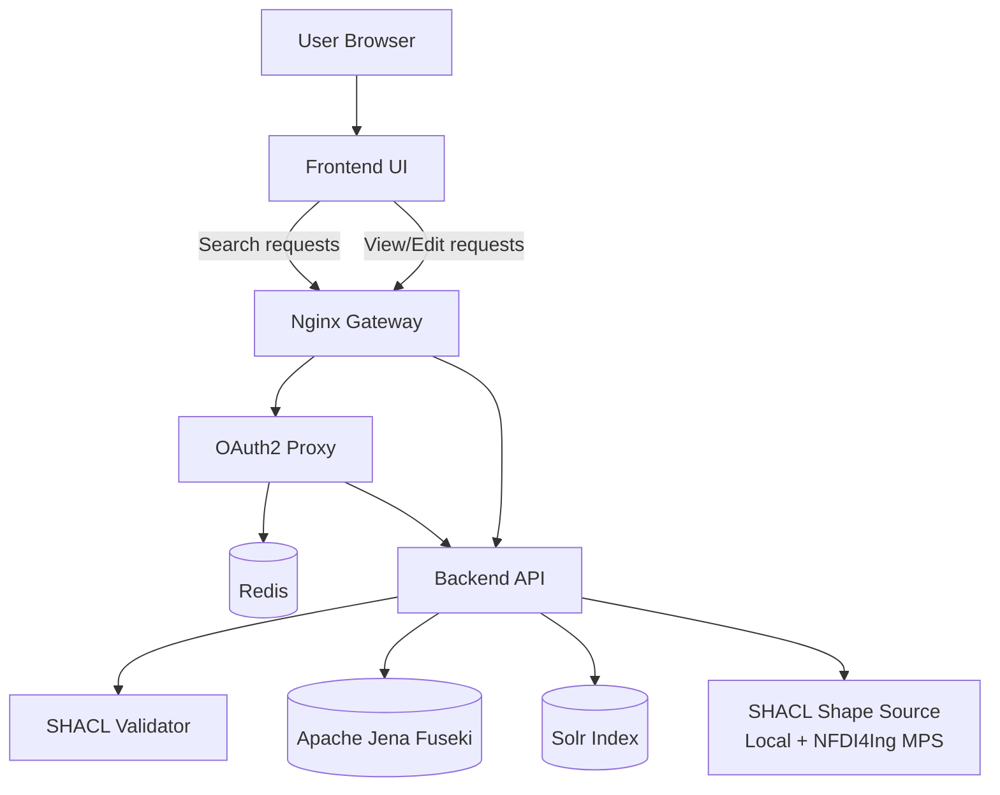

# RDF store

> Store and search on RDF data that conform to [SHACL](https://www.w3.org/TR/shacl/).

## Installation
```
git clone https://github.com/ULB-Darmstadt/rdf-store.git
cd rdf-store
cp .env.example .env (see below)
docker compose up -d
```
Afterwards, open browser at http://localhost:8089

### .env setup for Docker Compose
1. Copy the example file: `cp .env.example .env`.
1. Update values as needed:
   - `APP_URL`: base URL for the deployment (used in redirects).
   - `FUSEKI_PASSWORD`: admin password for Fuseki. Needs to be set before first starting the services.
   - `OAUTH2_PROXY_*`: OIDC/OAuth settings (issuer, client id/secret, cookie secret).
   - `DISABLE_OAUTH`: set to a non-empty value to bypass OAuth2 proxy.
   - `ALLOWED_ORIGINS`: optional CORS origins.
   - `RDF_NAMESPACE`, `LOG_LEVEL`: optional service tuning.


## Updating
```
cd rdf-store
git pull
docker compose up -d --build --force-recreate
```

## SHACL shapes (aka application profiles)
RDF store supports loading SHACL shapes locally from the directory `rdf-store/backend/local/profiles/` or remotely from the [NFDI4Ing metadata profiles service](https://profiles.nfdi4ing.de). See the [.env.example](./.env.example) file on how to enable/disable/configure these sources.

## Backend API
The backend API is exposed under `http://localhost:8089/api/v1/` when running via Docker Compose.
Key endpoints include:
- `/api/v1/sparql/query` for SPARQL queries on stored RDF resources.
- `/api/v1/solr/{colletion}/query` for SOLR search requests.
- `/api/v1/resource` for CRUD operations on RDF resources.

For a complete, interactive API reference, open the Swagger UI at `http://localhost:8089/api/v1/` or refer to the OpenAPI document at `http://localhost:8089/api/v1/openapi.json`.

Example SPARQL query:
```
curl -Lk -X POST http://localhost:8089/api/v1/sparql/query -d "query=SELECT * WHERE { GRAPH ?g {?s ?p ?o } }"
```

## Development setup
### Prerequisites
- install [go](https://go.dev/dl/)
- install [npm](https://docs.npmjs.com/downloading-and-installing-node-js-and-npm)

When modifying the code in this repo (backend or frontend), the recommended steps for running/testing the local changes are:
1. `cd rdf-store`
1. edit [docker-compose.yml](./docker-compose.yml) and comment in the port mappings for fuseki and solr
1. `docker compose up -d --build`
1. `docker compose stop app`
1. `cd backend && go run .` -> starts backend on port 3000, needs to be run again after each change in the backend
1. `cd frontend && npm run dev` -> starts frontend on port 5173 with live reload
1. open browser at http://localhost:5173

## Architecture

